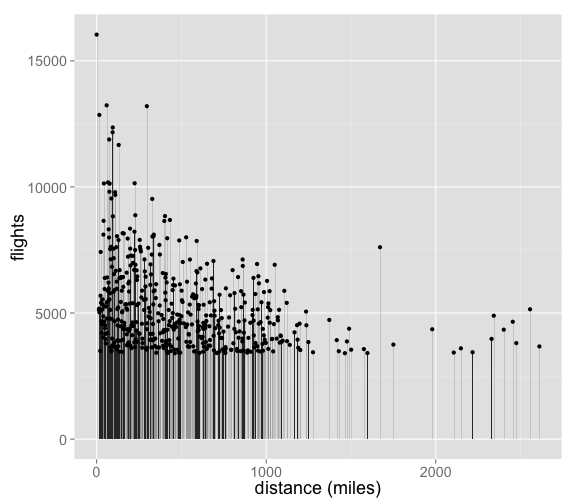

enigma
=======


[](https://travis-ci.org/rOpenGov/enigma)

**An R client for [Enigma.io](https://app.enigma.io/)**

Enigma holds government data and provides a really nice set of APIs for data, metadata, and stats on each of the datasets. That is, you can request a dataset itself, metadata on the dataset, and summary statistics on the columns of each dataset.

## Enigma.io

+ [Enigma.io home page](https://app.enigma.io/)
+ [Enigma.io API docs](https://app.enigma.io/api)

## License

MIT, see [LICENSE file](https://github.com/rOpenGov/enigma/blob/master/LICENSE) and [MIT text](http://opensource.org/licenses/MIT)

## Quick start

### Install


```r
install.packages("devtools")
devtools::install_github("ropengov/enigma")
```


```r
library("enigma")
```

### Get data


```r
out <- enigma_data(dataset='us.gov.whitehouse.visitor-list', select=c('namelast','visitee_namelast','last_updatedby'))
```

Some metadata on the results


```r
out$info
#> $rows_limit
#> [1] 50
#> 
#> $total_results
#> [1] 3965995
#> 
#> $total_pages
#> [1] 79320
#> 
#> $current_page
#> [1] 1
#> 
#> $calls_remaining
#> [1] 49958
#> 
#> $seconds_remaining
#> [1] 1378384
```

Look at the data, first 6 rows for readme brevity


```r
head(out$result)
#>   namelast visitee_namelast last_updatedby
#> 1 MATTHEWS            POTUS             LC
#> 2    DOYLE            POTUS             B3
#> 3 MATTHEWS            POTUS             LC
#> 4   MALONE            POTUS             DC
#> 5   WILSON            POTUS             DC
#> 6    ABEBE            POTUS             GB
```


### Statistics on dataset columns


```r
out <- enigma_stats(dataset='us.gov.whitehouse.visitor-list', select='total_people')
```

Some summary stats


```r
out$result[c('sum','avg','stddev','variance','min','max')]
#> $sum
#> [1] "1124496594"
#> 
#> $avg
#> [1] "284.9675774590850448"
#> 
#> $stddev
#> [1] "538.834750750563"
#> 
#> $variance
#> [1] "290342.888616420900"
#> 
#> $min
#> [1] "0"
#> 
#> $max
#> [1] "5730"
```


Frequency details


```r
head(out$result$frequency)
#>   total_people  count
#> 1            1 179164
#> 2            6 110585
#> 3            2 110305
#> 4            4  89524
#> 5            3  89288
#> 6            5  76722
```


### Metadata on datasets


```r
out <- enigma_metadata(dataset='us.gov.whitehouse')
```

Paths


```r
out$info$paths
#> [[1]]
#> [[1]]$level
#> [1] "us"
#> 
#> [[1]]$label
#> [1] "United States"
#> 
#> [[1]]$description
#> [1] "United States of Americaa"
#> 
#> [[1]]$description_lead
#> [1] "United States of America"
#> 
#> 
#> [[2]]
#> [[2]]$level
#> [1] "gov"
#> 
#> [[2]]$label
#> [1] "U.S. Federal Government"
#> 
#> [[2]]$description
#> [1] "Government from the Legislative, Executive, and Judicial branches of the United States of America."
#> 
#> [[2]]$description_lead
#> [1] "Government comprising the Legislative, Executive, and Judicial branches of the United States of America."
#> 
#> 
#> [[3]]
#> [[3]]$level
#> [1] "whitehouse"
#> 
#> [[3]]$label
#> [1] "The White House"
#> 
#> [[3]]$description
#> [1] "Located at 1600 Pennsylvania Avenue in Washington D.C., the White House has served as the home and office for every U.S. president since John Adams."
#> 
#> [[3]]$description_lead
#> [1] "Located at 1600 Pennsylvania Avenue in Washington D.C., the White House has served as the home and office for every U.S. president since John Adams."
```

Immediate nodes


```r
out$info$immediate_nodes
#> [[1]]
#> [[1]]$datapath
#> [1] "us.gov.whitehouse.salaries"
#> 
#> [[1]]$label
#> [1] "White House Salaries"
#> 
#> [[1]]$description
#> [1] "The White House report to Congress listing the title and salary of every White House Office employee since 1995."
```


Children tables


```r
out$info$children_tables[[1]]
#> $datapath
#> [1] "us.gov.whitehouse.nom-and-app"
#> 
#> $label
#> [1] "Nominations & Appointments"
#> 
#> $description
#> [1] "The nominees and appointees names, positions, agencies under which they are nominated or appointed, the agency's websites, nomination dates, and vote confirmation dates."
#> 
#> $db_boundary_datapath
#> [1] "us.gov.whitehouse"
#> 
#> $db_boundary_label
#> [1] "The White House"
```


### Use case: Plot frequency of flight distances

First, get columns for the air carrier dataset


```r
dset <- 'us.gov.dot.rita.trans-stats.air-carrier-statistics.t100d-market-all-carrier'
head(enigma_metadata(dset)$columns$table[,c(1:4)])
#>               id          label         type index
#> 1     passengers     Passengers type_varchar     0
#> 2        freight Freight (Lbs.) type_varchar     1
#> 3           mail    Mail (Lbs.) type_varchar     2
#> 4       distance Distance (Mi.) type_varchar     3
#> 5 unique_carrier Unique Carrier type_varchar     4
#> 6     airline_id     Airline ID type_numeric     5
```


Looks like there's a column called _distance_ that we can search on. We by default for `varchar` type columns only `frequency` bake for the column.


```r
out <- enigma_stats(dset, select='distance')
head(out$result$frequency)
#>   distance count
#> 1     0.00 16039
#> 2    59.00 13235
#> 3   296.00 13202
#> 4    16.00 12855
#> 5    95.00 12357
#> 6    94.00 12167
```

Then we can do a bit of tidying and make a plot


```r
library("ggplot2")
df <- out$result$frequency
df <- data.frame(distance=as.numeric(df$distance), count=as.numeric(df$count))
ggplot(df, aes(distance, count)) +
  geom_bar(stat="identity") +
  geom_point() +
  theme_grey(base_size = 18) +
  labs(y="flights", x="distance (miles)")
```

 

### Direct dataset download

Enigma provides an endpoint `.../export/<datasetid>` to download a zipped csv file of the entire dataset.

`enigma_fetch()` gives you an easy way to download these to a specific place on your machine. And a message tells you that a file has been written to disk.

```r
enigma_fetch(dataset='com.crunchbase.info.companies.acquisition')
```
